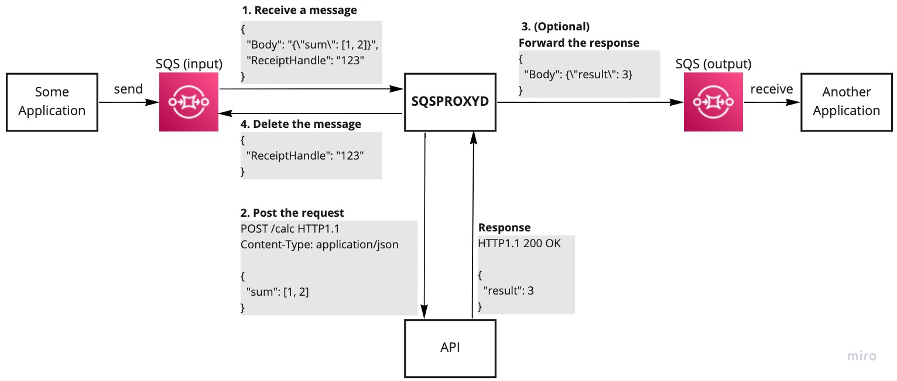

# sqsproxyd
**sqsproxyd** is SQS proxy daemon.

This is an application that imitates [SQS daemon](https://docs.aws.amazon.com/elasticbeanstalk/latest/dg/using-features-managing-env-tiers.html) provided in the [AWS Elastic Beanstalk](https://aws.amazon.com/jp/elasticbeanstalk/) worker environment.
In addition, it has the ability to send a response (= forward) to another SQS.



## Features
- Receive (dequeue) a message from SQS and make a POST request to the specified API.
- If the API returns a success response (HTTP status: 2**), removes the message from the SQS.
- [Option] If an output SQS is set, the API success response body be sent (enqueued) to that SQS as a message.

### Why does sqsproxyd implement response forwarding?
The purpose is to make it easy to build a microservice architecture system using SQS.
By completely hiding the SQS input and output in sqsproxyd (and its configuration), application developers can focus on implementing the API.

## Usage

### Execution

#### Command-line (binary)
The binaries can be downloaded [here](https://github.com/ohke/sqsproxyd/releases).

```bash
$ sqsproxyd \
  --sqs-url https://sqs.us-west-1.amazonaws.com/123456789012/sqsproxyd-sqs \
  --api-url http://localhost:4000/api 
```

#### Docker container
The sqsproxyd container image can also be pulled from Docker Hub.

```bash
$ docker pull ohke/sqsproxyd
$ docker run ohke/sqsproxyd \
  --sqs-url https://sqs.us-west-1.amazonaws.com/123456789012/sqsproxyd-sqs \
  --api-url http://localhost:4000/api
```

##### How can I use sqsproxyd images with AWS ECS or Kubernetes?
Please, see examples.

- [AWS ECS](example/aws)
- [Kubernetes](example/kubernetes)

### Configuration
Either method can be used to pass parameters. If a value exists for both, command-line arguments take precedence.

- Environment variables
- Command-line arguments

#### Parameters
| Command-line argument | Environment variable | Required | Default | Description |
| -- | -- | -- | -- | -- | 
| --aws-access-key-id | AWS_ACCESS_KEY_ID | no | - | Your AWS access key ID |
| --aws-secret-access-key | AWS_SECRET_ACCESS_KEY | no | - | Your AWS secret access key |
| --aws-session-token | AWS_SESSION_TOKEN | no | - | Your AWS session token |
| --aws-region | SQSPROXYD_AWS_REGION or AWS_DEFAULT_REGION | no | - | Your AWS region name |
| --aws-endpoint | SQSPROXYD_AWS_ENDPOINT | no | - | To use mock SQS (like [alpine-sqs](https://github.com/roribio/alpine-sqs)) |
| --sqs-url | SQSPROXYD_SQS_URL | yes | - | SQS URL to input |
| --api-url | SQSPROXYD_API_URL | yes | - | API URL to POST request |
| --output-sqs-url | SQSPROXYD_OUTPUT_SQS_URL | no | - | SQS URL to forward response message |
| --num-workers | SQSPROXYD_NUM_WORKERS | no | 1 | Number of concurrent workers |
| --api-timeout-seconds | SQSPROXYD_API_TIMEOUT_SECONDS | no | 30 | API connection timeout seconds |
| --sleep-seconds | SQSPROXYD_SLEEP_SECONDS | no | 1 | Interval seconds of receiving when retrieving 0 message |
| --api-health-url | SQSPROXYD_API_HEALTH_URL | no | - | API health check URL to GET request |
| --api-health-interval-seconds | SQSPROXYD_API_HEALTH_INTERVAL_SECONDS | no | 1 | Interval seconds of request health check endpoint |
| --content-type | SQSPROXYD_CONTENT_TYPE | no | `application/json` | Content-type header of API request. |
| --rust-log | SQSPROXYD_RUST_LOG | no | `WARN` | Application logging directive |

## Contribution

### Development

#### Prerequisites
Install followings.

- [cargo](https://doc.rust-lang.org/cargo/getting-started/installation.html)
- [cargo-make](https://github.com/sagiegurari/cargo-make)
- [direnv](https://github.com/direnv/direnv)
- [Docker](https://docs.docker.com/get-docker/)
- [docker-compose](https://docs.docker.com/compose/install/)

#### Clone and build
```bash
$ git clone https://github.com/ohke/sqsproxyd.git
$ cd sqsproxyd
$ cargo build
````

#### Run with mock SQS, API
```bash
$ cp ./env/local.env ./.env
$ direnv allow
$ docker-compose up -d sqsproxyd-sqs sqsproxyd-api
$ cargo run
```

### License
sqsproxyd is available under the Apache-2.0 open source license.
